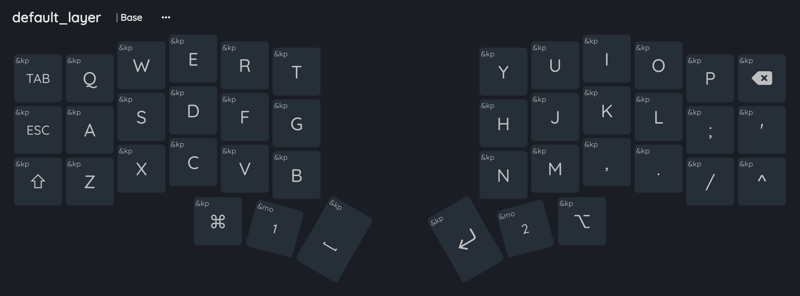
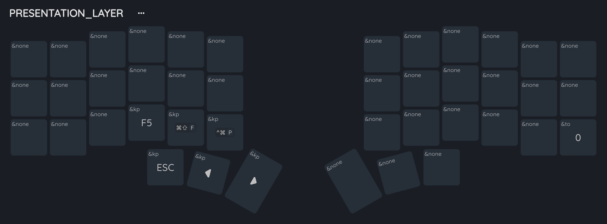

# Corne Keyboard Layout

Keyboard layout with QWERTY layout on Mac.
The layout images are produced by [Keymap Editor](https://nickcoutsos.github.io/keymap-editor/)

# Layouts
## Default layer

The default layer is QWERTY and replace CAPSLOCK by ESC

## Program Layer - Lower layer

Most of keys used in programming are accessible through this layer.

Left two lower rows are for brackets, and right two lower rows are for arithmetic/pointer operations.

## Navigation Layer - Upper layer

This layer is for navigation. Arrows and window manager shortcuts are defined here with VIM arrow convention.

## Function Layer - Super layer

Function keys and media keys, 

## Presentation Layer - Super layer

One-hand presentation related keys.
